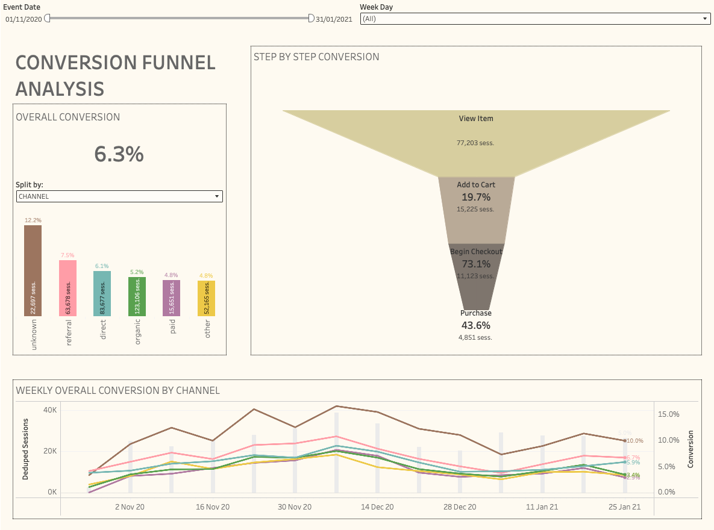

# GA4 Product Analytics – Funnel & Acquisition Performance
BigQuery · dbt · Tableau Public

## Project Overview
This project analyses the GA4 public e-commerce dataset to evaluate user behaviour across the purchase funnel, with a specific focus on:
Funnel performance
Device performance (Mobile vs Desktop)
Acquisition channel performance (e.g. Paid vs Organic)
The objective was to replicate a real-world Product Analytics workflow:
- Raw event-level data in BigQuery
- Structured transformation using dbt
- Session-level funnel modelling
- Executive dashboard in Tableau Public
- Business insights and product recommendations

## Architecture

- Data Source
GA4 public e-commerce dataset
bigquery-public-data.ga4_obfuscated_sample_ecommerce

- Data Warehouse
Google BigQuery (sandbox environment)

- Transformation Layer
dbt

- Structured layers:
stg (cleaned events)
intermediate (session-level funnel flags)
marts (analysis-ready tables)

- Visualisation
Tableau Public (CSV extracts from marts layer)

## Modelling Approach
- Session-Level Funnel Logic
The funnel was constructed at the session level using binary flags:
did_view_item
did_add_to_cart
did_begin_checkout
did_purchase
This allows clean step-to-step conversion analysis while keeping the modelling simple and performant.

- Funnel Structure
View Item → Add to Cart → Begin Checkout → Purchase
Conversion rates were calculated as:
View → Cart
Cart → Checkout
Checkout → Purchase
View → Purchase (overall conversion)

## Dashboard Structure

👉 **[View interactive dashboard on Tableau Public](https://public.tableau.com/views/ConversionFunnelAnalysis_17714995033540/ConversionFunnelAnalysis?:language=en-GB&publish=yes&:sid=&:redirect=auth&:display_count=n&:origin=viz_share_link)**

1. Overall Conversion
Displays:
Global overall conversion rate
Select Split by Channel or device
Compares:
Session volume
Conversion rates
Drop-off patterns when click on a bar
Purpose:
Identify UX friction and device-specific performance gaps.

2. Funnel Overview
Displays:
Total sessions
Step progression
Step-to-step drop-offs
Purpose:
Identify where users drop off in the purchase journey.

3. Weekly overall conversion rate by selected split
Displays:
Overall conversion rate by week by split over the selected period + number of weekly sessions
Purpose:
Evaluate seasonality or timely impact on overall conversion.

## Key Findings

Funnel Performance: Early-stage friction drives conversion loss
- Analysis of 360,974 sessions reveals a 6.3% overall conversion rate (View Item → Purchase), with the largest drop-off occurring before users add items to cart.
Using a consistent base (View Item) makes it easier to see where product/UX friction appears after intent is expressed.
- View Item → Add to Cart converts at 19.7% (15,225 of 77,203), representing an 80% drop-off—the primary conversion bottleneck.
- Cart → Checkout converts at 73.1% (11,123 of 15,225), suggesting cart abandonment is less critical than initial engagement.
- Checkout → Purchase converts at 43.6% (4,851 of 11,123), indicating checkout friction affects over half of users who begin checkout.

Business impact: 
Improving View → Cart conversion by 5 percentage points (from 19.7% to 24.7%) could yield ~3,860 additional purchases, representing a 79% increase in revenue.

Channel Performance: Attribution gaps mask optimization opportunities
- Channel analysis shows a 2.5x conversion gap between top and bottom performers, with data quality issues limiting actionable insights.
- Unknown channel shows 12.3% conversion (22,697 sessions), 2.5x higher than Paid—likely an attribution gap requiring investigation rather than a true performance signal.
- Referral traffic converts at 7.5% (63,678 sessions), second-highest and 56% above Paid, indicating strong intent from partner/referral sources.
- Organic Search drives 34% of sessions (123,106) but converts at 5.2%, below Direct (6.1%) and Referral (7.5%), suggesting potential landing page or intent alignment issues.
Paid Search converts at 4.8% (15,651 sessions), lowest among tracked channels and 23% below Organic, indicating targeting or landing page misalignment.

Business impact: 
If Paid conversion matched Organic (5.2%), ~60 additional purchases could be generated. If Unknown channel traffic were properly attributed and optimized, the 12.3% conversion rate could inform channel strategy.

Device Performance: Mobile conversion advantage despite volume gap
- Desktop accounts for 58% of sessions (209,458) but converts at 6.1%, slightly below mobile.
- Mobile accounts for 40% of sessions (143,500) and converts at 6.5%, a 7% relative advantage over desktop.
- Conversion rates are similar across devices at each funnel step, with the largest gap at View → Cart (Mobile 19.9% vs Desktop 19.6%).
Business insight: The mobile conversion advantage, combined with mobile’s lower session volume, suggests untapped mobile growth potential. Mobile optimization could increase both volume and conversion.

## Product Recommendations
Priority 1: Address View → Cart conversion bottleneck (High Impact, Medium Effort)
Problem: 80% of users who view items don't add to cart (19.7% conversion), representing the largest funnel drop-off.
Recommendations:
1. Enhance product discovery and value communication
e.g. Add prominent "add to Cart", Display shipping, returns, reviews on product cards...
Success metric: Increase View → Cart conversion from 19.7% to 24.7% (+5pp)
2. Reduce price friction
e.g. show shipping cost end estimated delivery dates before cart, display discount badge prominently...
Success metric: Reduce cart abandonment rate by 15%
3. Improve product page engagement
e.g. Implement product recommendations on product page, add recent purchases, stock indicators...
Success metric: Increase average time on product pages by 20%

Priority 2: Fix Paid channel performance (High Impact, High Effort)
Problem: Paid Search converts at 4.8% (lowest among channels), 23% below Organic despite likely higher cost per acquisition.
Recommendations:
1. Audit and optimize landing pages
e.g. Map top Paid keywords to specific landing pages, Ensure landing pages match search intent (product pages for product queries, category pages for browsing queries)...
Success metric: Increase Paid conversion from 4.8% to 5.2% (matching Organic baseline)
2. Improve attribution and tracking
e.g. Investigate Unknown channel (12.3% conversion) to identify misattributed Paid traffic, Set up conversion tracking for campaign-level performance...
Success metric: Reduce Unknown channel to <3% of total sessions, properly attributed
3. Refine targeting and ad copy
e.g. Analyze search query reports to identify low-intent keywords, Pause or refine campaigns with <3% conversion rates
Success metric: Improve Paid View → Cart rate from 17.9% to 20%+

Priority 3: Address checkout abandonment (Medium Impact, Low Effort)
Problem: 43.6% of users who begin checkout complete purchase, indicating checkout friction.
Recommendations:
1. Simplify checkout flow
e.g. Reduce checkout steps from multi-page to single-page (or progress indicator), Enable guest checkout option prominently, Pre-fill shipping information where possible...
Success metric: Increase Checkout → Purchase rate from 43.6% to 50%+
2. Improve checkout transparency
e.g. Show full order summary (items, shipping, taxes) before payment, Display trust badges and security indicators, Add clear return policy and shipping information...
Success metric: Reduce checkout abandonment by 20%

## Suggested Experiments
- Experiment 1: Product page CTA optimization (A/B Test)
  
Hypothesis: Adding prominent "Add to Cart" CTAs above the fold and displaying key value props (shipping, returns) will increase View → Cart conversion by 5pp (from 19.7% to 24.6%).  
Test Design:  
Control: Current product page layout  
Variant A: Bigger, more visible “Add to Cart” button placed high on the page, plus a small strip highlighting key benefits (e.g. free returns, fast delivery).  
Variant B:  “Quick View” pop‑up where users can see key product info and add to cart without leaving the listing page, with benefits shown right inside that pop‑up.  
Traffic Split: 33/33/34  
Duration: 4 weeks  
Sample Size: ~25,000 sessions per variant  
Success Metrics:  
Primary: View → Cart conversion rate (target: +5pp)  
Secondary: Time to add to cart, bounce rate, overall conversion rate  
Decision Criteria: Variant with highest View → Cart conversion (statistically significant at p<0.05) wins and rolls out.  

- Experiment 2: Checkout simplification (A/B Test)
  
Hypothesis: A single-page checkout with guest option will increase Checkout → Purchase conversion from 43.6% to 50% by reducing friction.  
Test Design:  
Control: Multi-step checkout (current state)  
Variant: Single-page checkout with prominent guest checkout option  
Traffic Split: 50/50  
Duration: 4 weeks  
Sample Size: ~5,500 checkout starts per variant  
Success Metrics:  
Primary: Checkout → Purchase conversion rate (target: 50%+)  
Secondary: Checkout completion time, form errors, guest vs. registered conversion  
Decision Criteria: Variant with ≥6.4pp lift (statistically significant) wins. Monitor for impact on customer data collection.  

## Why This Project Matters
This project demonstrates:
End-to-end analytics engineering workflow
Event-based modelling using GA4
Session-level funnel logic
Marketing attribution grouping
Executive-ready data storytelling
Business-oriented recommendations
It reflects how a Product Analyst would structure analysis in a real-world e-commerce environment.

## Repository Structure
models/
  staging/
  intermediate/
  marts/

data/
  exports/

README.md
How to Reproduce
Set up BigQuery project
Connect dbt to GA4 public dataset
Run:
dbt run
dbt test
Export marts layer for visualisation
Open in Tableau Public
🎯 Next Steps
Retention analysis post-purchase
New vs Returning user comparison
Revenue per session analysis
Advanced attribution modelling
Funnel strict ordering using timestamps
🏁 Conclusion
This project illustrates how structured data modelling and clear visual storytelling can turn raw event data into actionable product and marketing insights.
